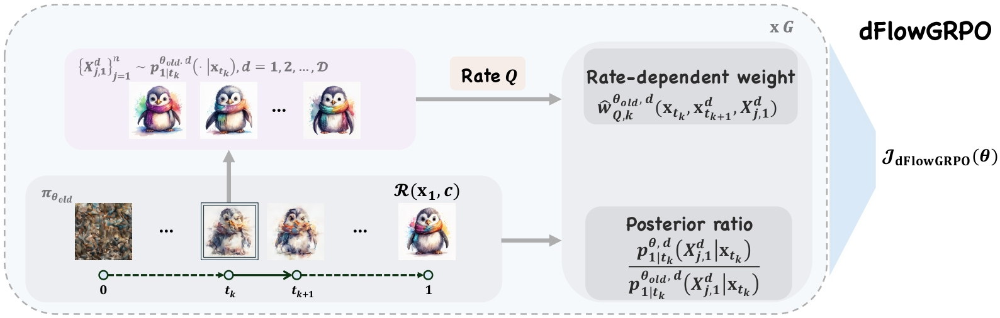

# dFlowGRPO

Rate-Aware RL for [FUDOKI](https://huggingface.co/LucasJinWang/FUDOKI),
a discrete flow-based multimodal model.

<p align="center">
  
</p>

Released LoRA adapters:

| Task      | HF repo |
| --------- | ------- |
| PickScore | [`PickScore`](https://huggingface.co/ZhengyanWan/dFlowGRPO-PickScore) |
| GenEval   | [`GenEval`](https://huggingface.co/ZhengyanWan/dFlowGRPO-GenEval) |
| ScienceQA | [`ScienceQA`](https://huggingface.co/ZhengyanWan/dFlowGRPO-ScienceQA) |

## Install

```bash
conda create -n dflow_grpo python=3.10 -y
conda activate dflow_grpo
pip install torch==2.6.0 torchvision==0.21.0 \
    --index-url https://download.pytorch.org/whl/cu124
cd dFlowGRPO && pip install -r requirements.txt

huggingface-cli download LucasJinWang/FUDOKI --local-dir FUDOKI/checkpoints
```

Replace every `/your_path` in the launchers with your absolute paths
(conda root + repo root):

```bash
cd discrete_flow_grpo
sed -i 's|/your_path|/abs/path/to|g' run_train_*.sh run_eval*.sh accelerate_config_ds.yaml
```

## Train

```bash
cd discrete_flow_grpo
bash run_train_grpo.sh                                  # T2I GRPO  (PickScore reward)
bash run_train_dpo.sh                                   # T2I DPO
bash run_train_diffugrpo.sh                             # T2I DiffuGRPO
bash run_train_grpo_understanding.sh    # ScienceQA understanding GRPO
```

Hyper-parameters: `train_args.py`, `train_args_dpo.py`,
`train_args_understanding.py`. Common knobs are exposed as env vars on the
launchers: `NUM_GPUS`, `RUN_TAG`, `RESUME_STEP`, `SAMPLE_BATCH_SIZE`,
`TRAIN_BATCH_SIZE`, `KL_BETA`, `DATASET`, ...

## Evaluate released checkpoints

Checkpoints are downloaded directly under `discrete_flow_grpo/`:

```bash
cd discrete_flow_grpo

# PickScore
huggingface-cli download ZhengyanWan/dFlowGRPO-PickScore \
    --local-dir output_grpo_pickscore/checkpoint_0_step6300
BATCH=0 STEP=6300 EVAL_REWARD=pickscore TRAIN_REWARD=pickscore bash run_eval.sh

# GenEval  (needs the GenEval reward server, see flow_grpo)
huggingface-cli download ZhengyanWan/dFlowGRPO-GenEval \
    --local-dir output_grpo_geneval/checkpoint_0_step3300
BATCH=0 STEP=3300 EVAL_REWARD=geneval TRAIN_REWARD=geneval bash run_eval.sh

# ScienceQA
huggingface-cli download ZhengyanWan/dFlowGRPO-ScienceQA \
    --local-dir output_grpo_u_scienceqa_kl0.01/checkpoint_0_step1500
STEP=1500 bash run_eval_understanding_scienceqa.sh
```

## Datasets / reward servers

* T2I prompt sets and reward servers — see
  [`flow_grpo`](https://github.com/yifan123/flow_grpo). Place prompt files at
  `flow_grpo/dataset/<DATASET>/`.
* **ScienceQA** — `data_understanding.py` expects:

  ```
  discrete_flow_grpo/dataset_understanding/ScienceQA/
      data/scienceqa/problems.json   # qid -> {question, choices, answer, image, split, ...}
      train/<qid>/image.png
      val/<qid>/image.png
      test/<qid>/image.png
  ```

  Either follow [lupantech/ScienceQA](https://github.com/lupantech/ScienceQA)
  or convert the HF mirror `derek-thomas/ScienceQA` (parquet) to one PNG per
  question + a single split-keyed `problems.json`. The understanding launcher
  also has an optional GPT-style judge; set `USE_API_JUDGE=0` (or export a
  real `OPENAI_API_KEY`).


